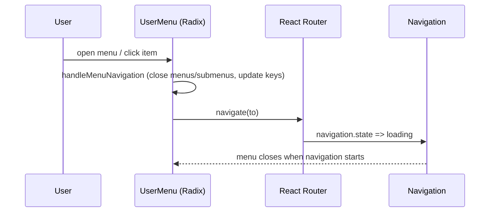

# Process Diagrams

## Navigation Flow

```mermaid
sequenceDiagram

participant User as User
participant Menu as UserMenu (Radix)
participant Router as React Router
participant Nav as Navigation

User->>Menu: open menu / click item
Menu->>Menu: handleMenuNavigation (close menus/submenus, update keys)
Menu->>Router: navigate(to)
Router->>Nav: navigation.state => loading
Nav-->>Menu: menu closes when navigation starts
```
