# Architecture Analysis

## Overview

This document provides a comprehensive architectural analysis of the Tournado tournament management system, examining component relationships, data flow patterns, and system design principles.

## System Architecture Diagram

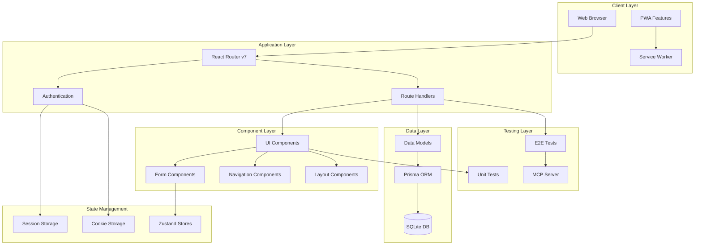

## Component Interaction Flow

### Component Communication Diagram

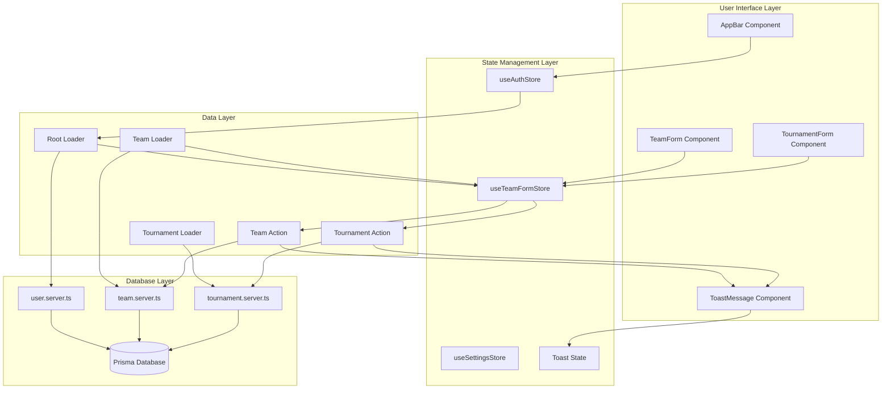

### Request-Response Flow Diagram

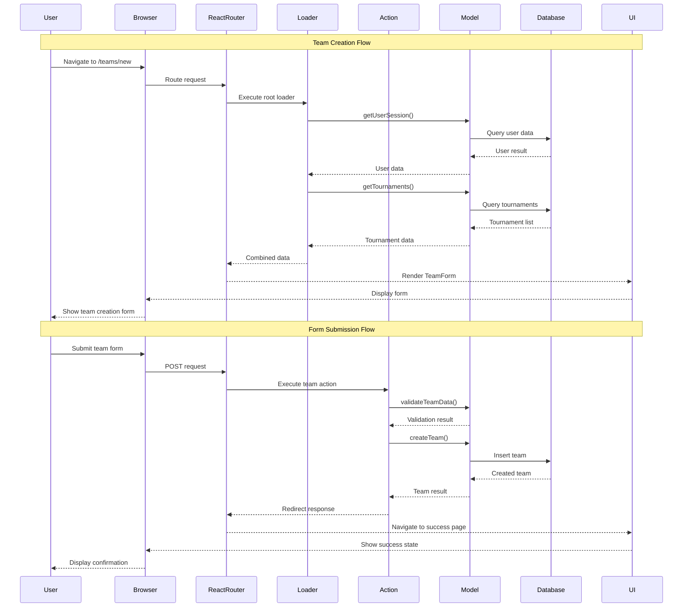

## Component Architecture Analysis

### Component Hierarchy and Organization

The application follows a well-structured component hierarchy:

```
app/components/
├── buttons/              # Action components
│   ├── ActionButton.tsx
│   └── ActionLinkButton.tsx
├── inputs/              # Form input components
│   ├── ComboField.tsx
│   ├── TextInputField.tsx
│   └── CheckboxAgreementField.tsx
├── navigation/          # Navigation components
│   ├── AppBar.tsx
│   ├── BottomNavigation.tsx
│   └── mobileNavigation/
├── layouts/             # Layout components
│   └── TeamsLayoutHeader.tsx
├── auth/               # Authentication components
│   ├── SignIn.tsx
│   └── SignUp.tsx
├── shared/             # Shared utilities
│   ├── colorVariants.ts
│   └── field.variants.ts
└── domain-specific/    # Feature-specific components
    ├── teams/
    ├── tournaments/
    └── ToastMessage/
```

### Component Design Patterns

#### 1. Variant-Based Design System

The application uses Class Variance Authority (CVA) for consistent styling:

- **Centralized variants**: `*.variants.ts` files co-located with components
- **Type-safe styling**: TypeScript integration with Tailwind classes
- **Responsive design**: Mobile-first approach with `lg:` breakpoint usage

#### 2. Form Component Architecture

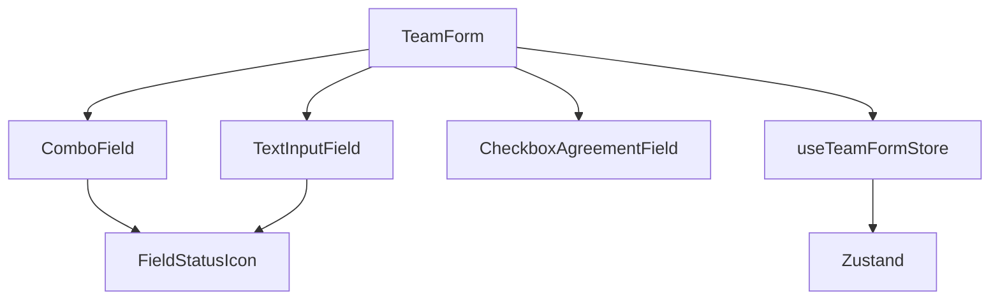

**Key Patterns:**

- **Controlled components** with centralized state management
- **Form validation** with field-level and form-level validation
- **Status indicators** for real-time feedback
- **Store integration** for complex form state

#### 3. Navigation Component Pattern

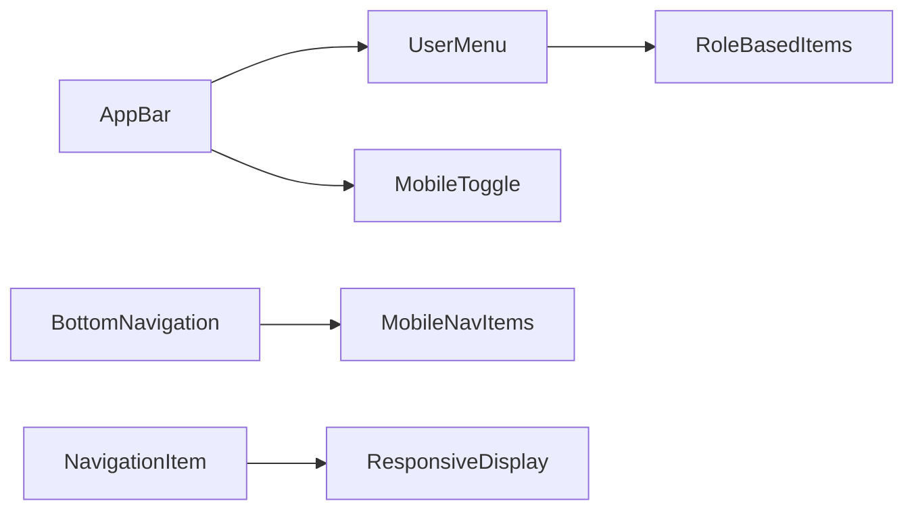

**Features:**

- **Role-based rendering**: Different menu items based on user permissions
- **Responsive navigation**: Desktop AppBar + Mobile BottomNavigation
- **Authentication awareness**: Dynamic content based on auth state

## Data Flow Architecture

### Server-Side Data Flow

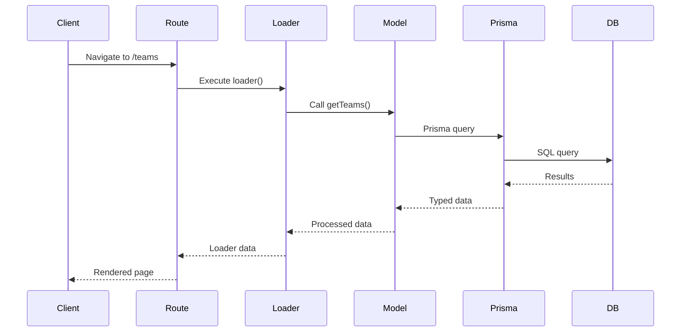

### Client-Side State Flow

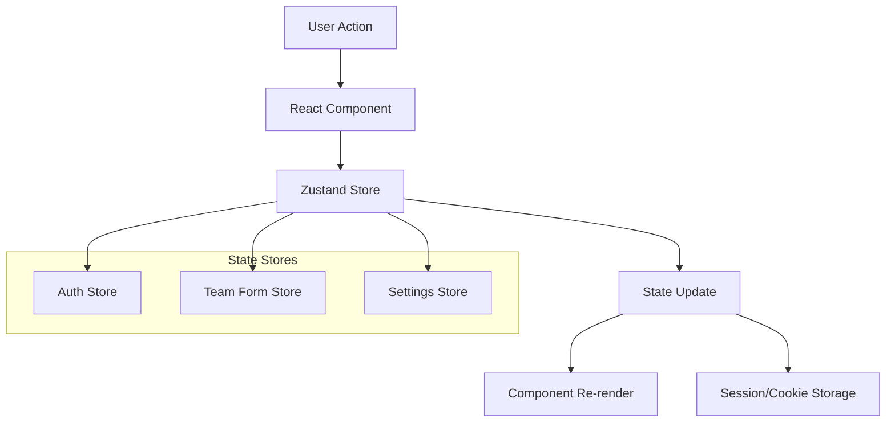

## Database Architecture

### Entity Relationship Diagram

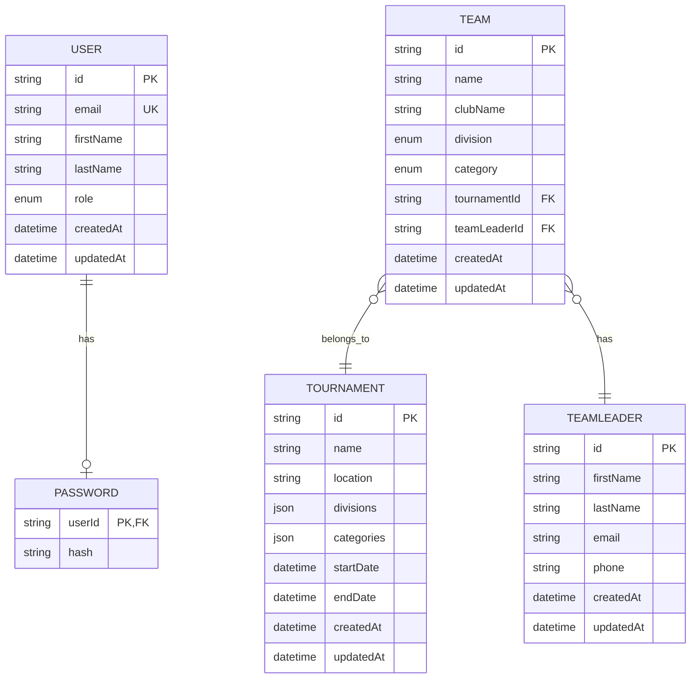

### Data Access Patterns

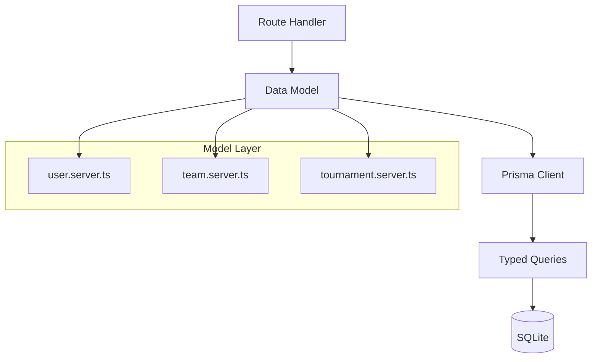

**Data Access Principles:**

- **Server-side only**: Database access restricted to `.server.ts` files
- **Type safety**: Prisma generates TypeScript types from schema
- **Query optimization**: Selective field loading with Prisma select
- **Relationship loading**: Explicit includes for related data

## Authentication & Authorization Flow

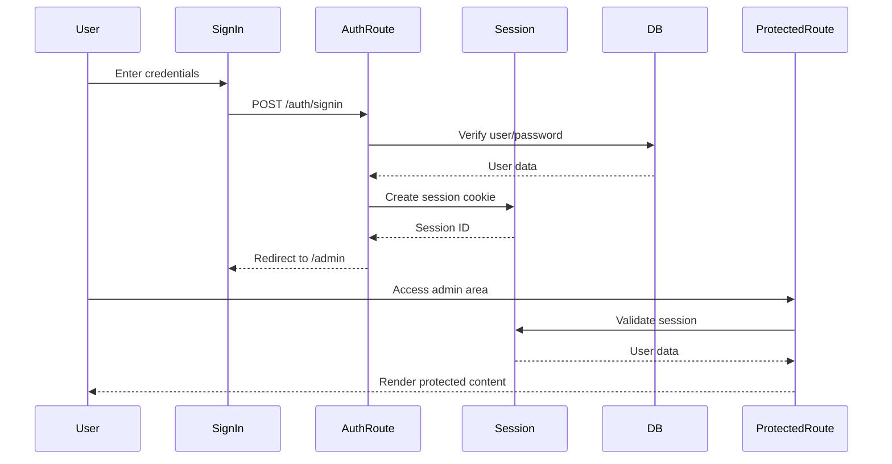

### Role-Based Access Control

```typescript
// Route metadata for access control
export const handle: RouteMetadata = {
   isPublic: false,
   auth: {
      required: true,
      redirectTo: '/auth/signin',
   },
   authorization: {
      requiredRoles: ['ADMIN'],
      roleMatchMode: 'any',
      redirectTo: '/unauthorized',
   },
}
```

## Testing Architecture

### Test Pyramid Structure

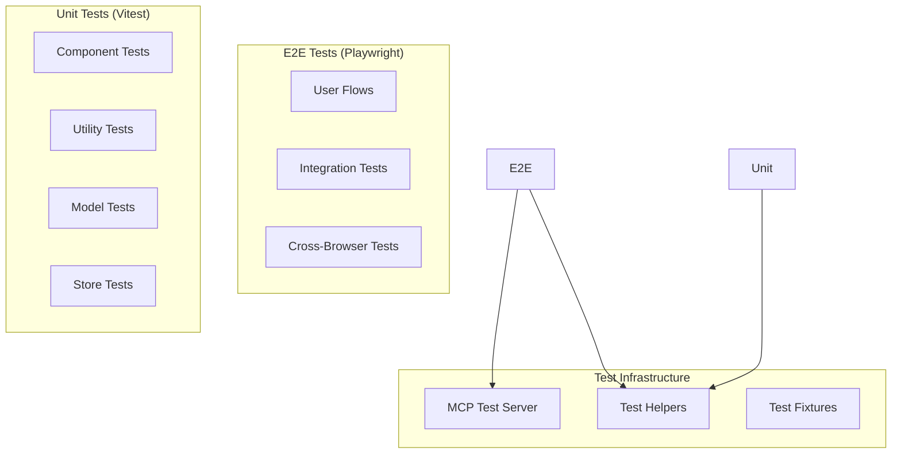

### Test Organization Patterns

- **Co-located tests**: `__tests__` folders adjacent to source code
- **Page Object Model**: Playwright tests use page objects for maintainability
- **Shared fixtures**: Common test setup and data creation utilities
- **Test isolation**: Each test runs with clean database state

## Performance Architecture

### Optimization Strategies

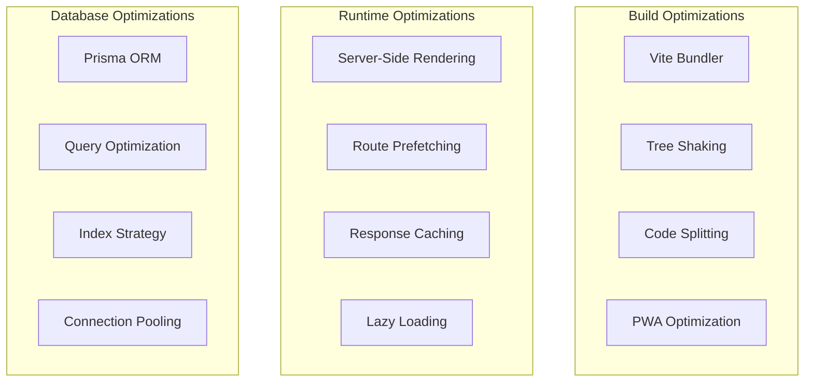

### Caching Strategy

- **Service Worker**: Offline-first caching for static assets
- **Session Storage**: Client-side form state persistence
- **Cookie Storage**: Authentication and preferences
- **Database Caching**: Prisma query result caching

## Deployment Architecture

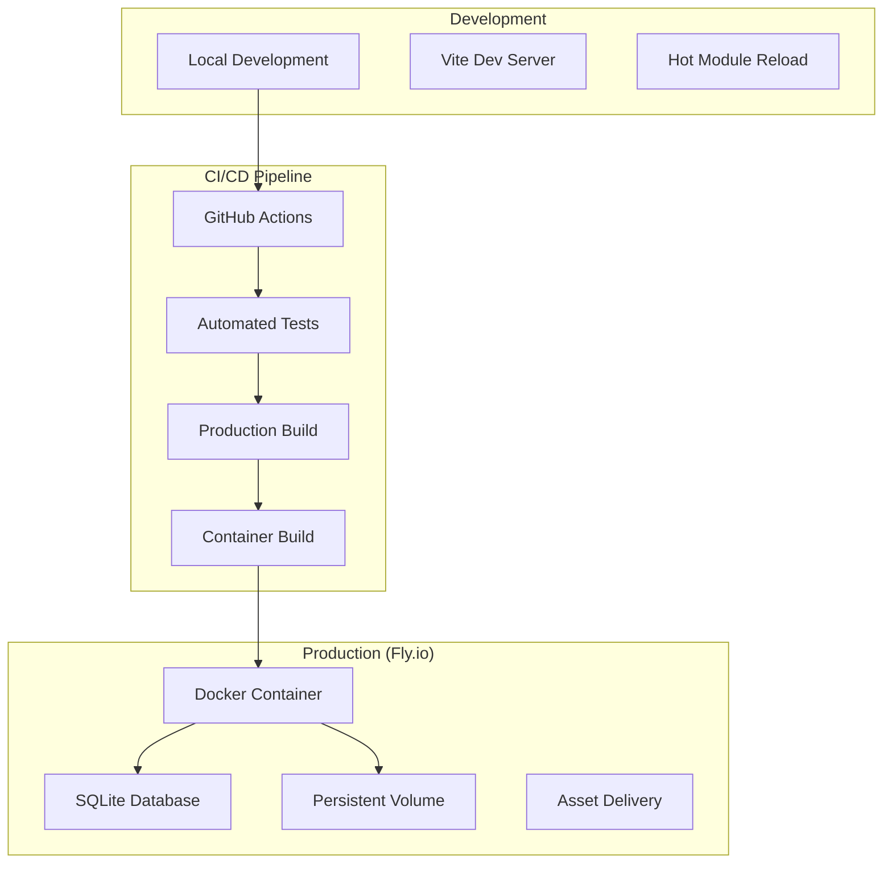

## Security Architecture

### Security Measures

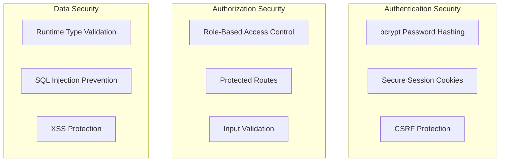

### Security Best Practices

- **Password Security**: bcrypt with salt rounds for password hashing
- **Session Management**: HttpOnly, Secure, SameSite cookie attributes
- **Input Validation**: Zod schema validation for all user inputs
- **SQL Injection Prevention**: Prisma ORM with parameterized queries
- **XSS Prevention**: React's built-in XSS protection + CSP headers

## CodeRabbit Architecture Analysis

### Form Submission Flow (Enhanced UX Pattern)

CodeRabbit identified a sophisticated form submission pattern that enhances user experience:

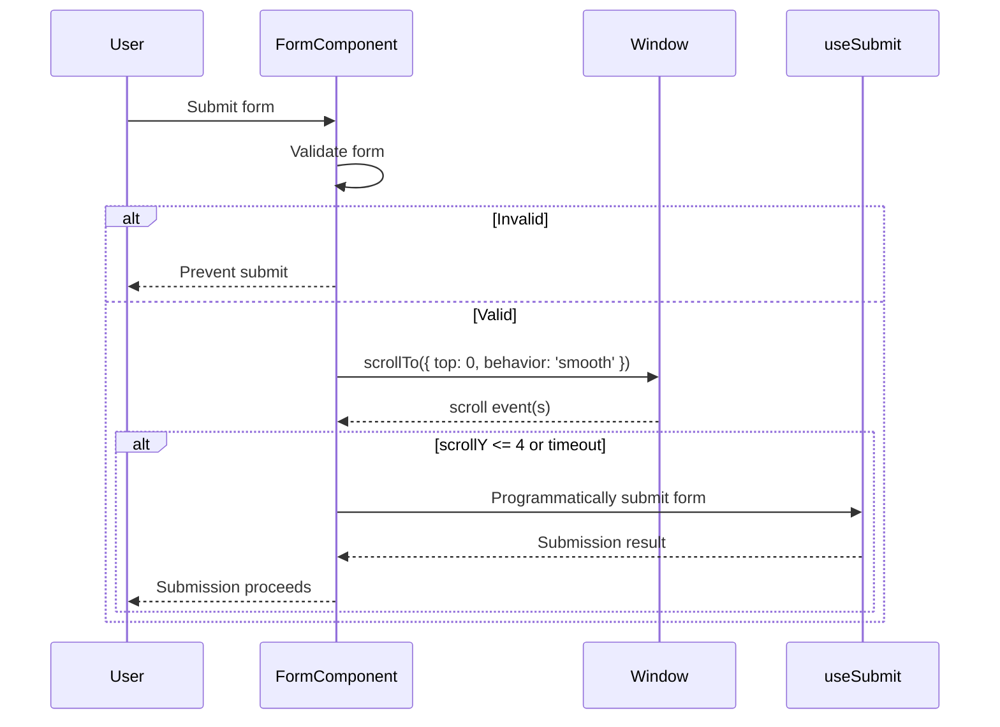

**Key Architecture Features:**

- **Smooth scroll-to-top**: Before form submission for better UX
- **Re-entry prevention**: Guards against duplicate submissions
- **Memory leak prevention**: Proper cleanup of scroll listeners
- **Timeout handling**: Fail-safe mechanisms for interrupted scroll

### Toast Notification System Architecture

CodeRabbit analyzed the toast notification system revealing advanced patterns:

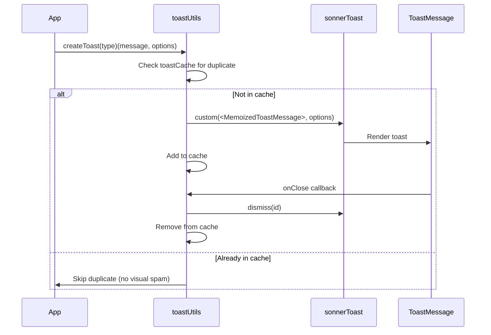

**Advanced Architecture Features:**

- **Duplicate Prevention**: Cache-based system prevents toast spam
- **Memory Optimization**: React.memo for performance
- **Auto-cleanup**: Automatic cache cleanup on toast dismissal
- **Type Safety**: Full TypeScript integration

## Code Quality Architecture

### Static Analysis Tools

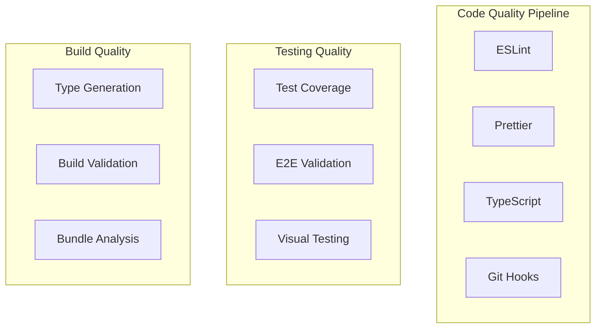

### Quality Metrics

- **Test Coverage**: 70% minimum across all metrics
- **Type Safety**: 100% TypeScript coverage, no `any` types
- **Code Style**: Automated formatting with Prettier
- **Linting**: Comprehensive ESLint rules with error prevention
- **Bundle Size**: Optimized with tree shaking and code splitting

## Scalability Considerations

### Current Architecture Strengths

1. **Component Modularity**: Well-organized, reusable components
2. **Type Safety**: Strong typing prevents runtime errors
3. **Database Optimization**: Efficient queries with Prisma
4. **Caching Strategy**: Multi-layer caching approach
5. **Testing Coverage**: Comprehensive test suite

### Future Scalability Paths

1. **Database Migration**: SQLite → PostgreSQL for production scale
2. **Microservices**: Extract domain services as needed
3. **CDN Integration**: Static asset optimization
4. **Horizontal Scaling**: Container orchestration preparation
5. **Performance Monitoring**: APM integration ready

#project #architecture #reference #ai-analysis
