# Architecture Analysis

## Overview

This document provides a comprehensive architectural analysis of the Tournado tournament management system, examining component relationships, data flow patterns, and system design principles.

## System Architecture Diagram

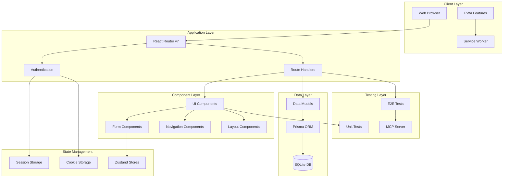

## Component Interaction Flow

### Component Communication Diagram

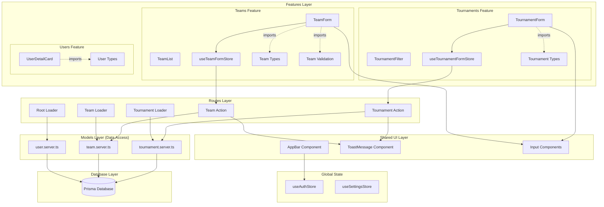

### Request-Response Flow Diagram

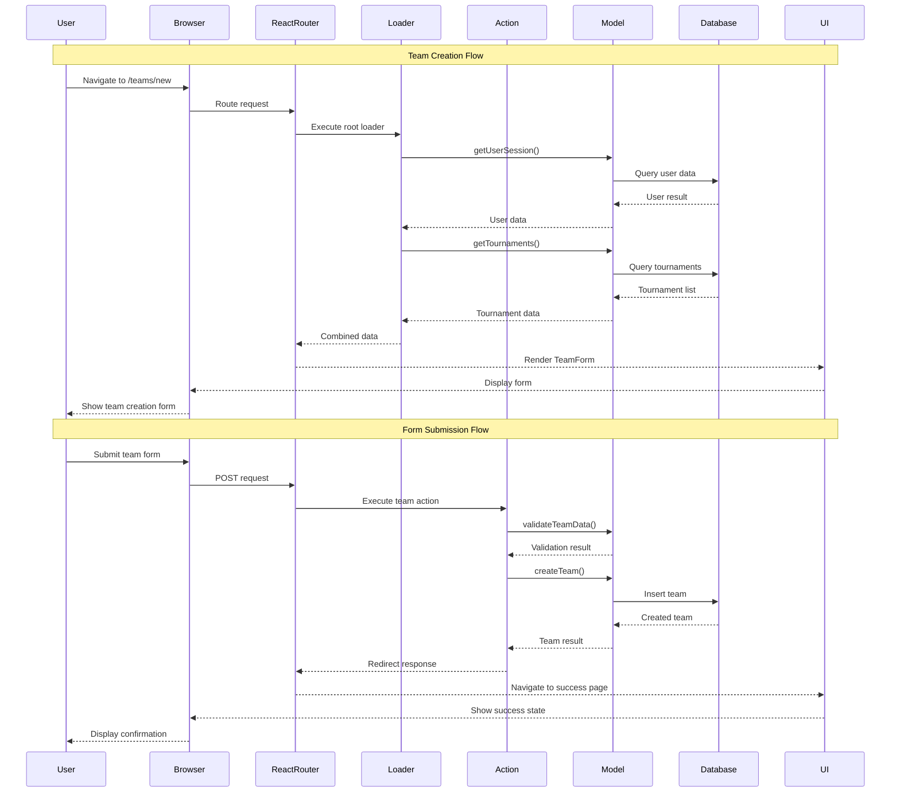

## Component Architecture Analysis

### Component Hierarchy and Organization

The application follows a modular feature-based architecture with clear separation between shared components and feature-specific code:

```
app/
├── features/           # Feature modules (self-contained domains)
│   ├── teams/
│   │   ├── components/     # Team-specific components
│   │   │   ├── TeamForm.tsx
│   │   │   ├── TeamList.tsx
│   │   │   ├── TeamsPageContent.tsx
│   │   │   ├── TeamsLayoutHeader.tsx
│   │   │   ├── TeamChip/
│   │   │   │   ├── TeamChip.tsx
│   │   │   │   ├── teamChip.variants.ts
│   │   │   │   └── __tests__/
│   │   │   └── __tests__/
│   │   ├── stores/         # Team-specific state management
│   │   │   ├── useTeamFormStore.ts
│   │   │   ├── helpers/
│   │   │   │   ├── teamFormTypes.ts
│   │   │   │   ├── teamFormHelpers.ts
│   │   │   │   ├── teamFormConstants.ts
│   │   │   │   └── __tests__/
│   │   │   └── __tests__/
│   │   ├── utils/          # Team-specific utilities
│   │   │   ├── teamCreation.server.ts
│   │   │   └── __tests__/
│   │   ├── hooks/          # Team-specific React hooks
│   │   ├── types.ts        # Team-specific TypeScript types
│   │   └── validation.ts   # Team-specific Zod schemas
│   │
│   ├── tournaments/
│   │   ├── components/     # Tournament-specific components
│   │   │   ├── TournamentForm.tsx
│   │   │   ├── TournamentFilter.tsx
│   │   │   ├── TournamentTableColumns.tsx
│   │   │   └── __tests__/
│   │   ├── stores/         # Tournament state management
│   │   │   └── useTournamentFormStore.ts
│   │   ├── hooks/          # Tournament hooks
│   │   │   └── useTournamentFilter.ts
│   │   ├── types.ts        # Tournament types
│   │   └── validation.ts   # Tournament validation
│   │
│   ├── users/
│   │   ├── components/     # User management components
│   │   │   ├── UserDetailCard.tsx
│   │   │   ├── UserAuditLogList.tsx
│   │   │   └── __tests__/
│   │   ├── types.ts        # User types
│   │   └── validation.ts   # User validation
│   │
│   └── firebase/
│       ├── client.ts       # Firebase client SDK (browser)
│       ├── server.ts       # Firebase Admin SDK (server)
│       ├── session.server.ts
│       ├── components/     # Firebase auth components
│       │   ├── FirebaseSignIn/
│       │   └── FirebaseEmailSignIn/
│       ├── adapters/       # Firebase adapters
│       └── __tests__/
│
├── components/         # Shared/reusable components
│   ├── buttons/            # Action components
│   │   ├── ActionButton.tsx
│   │   └── ActionLinkButton.tsx
│   ├── inputs/             # Form input components
│   │   ├── ComboField.tsx
│   │   ├── TextInputField.tsx
│   │   └── CheckboxAgreementField.tsx
│   ├── navigation/         # Navigation components
│   │   ├── AppBar.tsx
│   │   ├── BottomNavigation.tsx
│   │   └── mobileNavigation/
│   ├── layouts/            # Layout components
│   │   └── CompetitionLayoutHeader.tsx
│   ├── icons/              # Icon components
│   ├── shared/             # Shared utilities
│   │   ├── colorVariants.ts
│   │   └── field.variants.ts
│   ├── Panel/              # Panel component system
│   ├── ToastMessage/       # Toast notification system
│   ├── emails/             # Email templates
│   └── examples/           # Example/demo components
│
├── routes/             # React Router v7 file-based routing
│   ├── teams/              # Public team routes
│   ├── a7k9m2x5p8w1n4q6r3y8b5t1/  # Protected admin routes
│   │   ├── teams/
│   │   ├── tournaments/
│   │   ├── users/
│   │   └── competition/
│   └── auth/
│
├── models/             # Data access layer (server-only)
│   ├── team.server.ts
│   ├── tournament.server.ts
│   └── user.server.ts
│
├── stores/             # Global client state
│   ├── useAuthStore.ts
│   └── useSettingsStore.ts
│
└── lib/                # Shared utilities and types
    ├── lib.types.ts        # Shared types only (NO feature re-exports)
    └── theme.types.ts
```

### Feature Module Architecture

**Key Principles:**

1. **Self-Contained Features**: Each feature is a complete, independent module
2. **No Re-Exports**: Feature types imported directly from `~/features/{feature}/types`
3. **Co-located Tests**: Tests live next to source code in `__tests__/` folders
4. **Clear Boundaries**: Features don't import from each other (use shared lib when needed)

**Feature Module Structure:**

```typescript
// ✅ CORRECT - Direct feature imports
import { Team, TeamFormData } from '~/features/teams/types'
import { Tournament } from '~/features/tournaments/types'

// ❌ WRONG - No re-exports from lib
import { Team } from '~/lib/lib.types'  // Feature types don't belong in lib
```

**Shared vs. Feature-Specific:**

- **Shared components** (`app/components/`): Reusable across features (buttons, inputs, navigation)
- **Feature components** (`app/features/{feature}/components/`): Domain-specific, used only within one feature
- **Shared types** (`app/lib/lib.types.ts`): Generic types (IconProps, ColorAccent, Email)
- **Feature types** (`app/features/{feature}/types.ts`): Domain models (Team, Tournament, User)

### Component Design Patterns

#### 1. Variant-Based Design System

The application uses Class Variance Authority (CVA) for consistent styling:

- **Centralized variants**: `*.variants.ts` files co-located with components
- **Type-safe styling**: TypeScript integration with Tailwind classes
- **Responsive design**: Mobile-first approach with `lg:` breakpoint usage

#### 2. Form Component Architecture

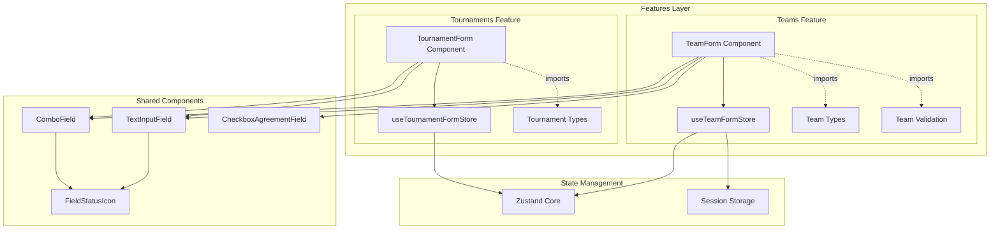

**Key Patterns:**

- **Feature Isolation**: Forms and stores live within feature modules
- **Shared Components**: Reusable input components in `~/components/inputs/`
- **Controlled Components**: Centralized state management via Zustand
- **Form Validation**: Field-level and form-level validation with Zod
- **Status Indicators**: Real-time feedback via shared FieldStatusIcon
- **Store Integration**: Complex form state with persistence (sessionStorage)
- **Type Safety**: Direct imports from feature types (no re-exports)

#### 3. Navigation Component Pattern

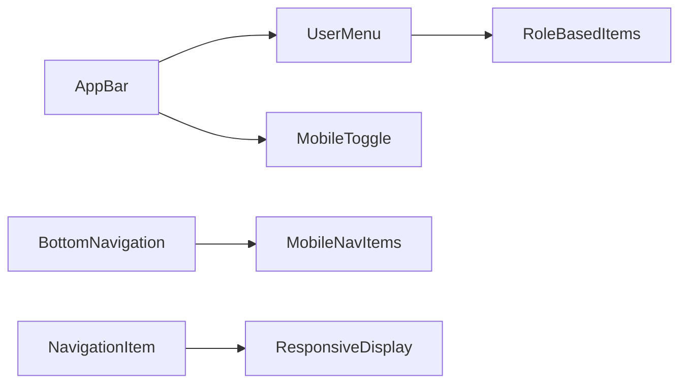

**Features:**

- **Role-based rendering**: Different menu items based on user permissions
- **Responsive navigation**: Desktop AppBar + Mobile BottomNavigation
- **Authentication awareness**: Dynamic content based on auth state

### Architectural Benefits of Feature Modules

The feature-based architecture provides significant advantages over traditional flat component structures:

#### 1. **Scalability & Maintainability**

```typescript
// Before: Scattered files across multiple directories
app/components/TeamForm.tsx
app/components/TeamList.tsx
app/stores/useTeamFormStore.ts
app/lib/lib.types.ts (with re-exported Team types)

// After: Self-contained feature module
app/features/teams/
├── components/TeamForm.tsx
├── components/TeamList.tsx
├── stores/useTeamFormStore.ts
└── types.ts (Team types defined here)
```

**Benefits:**

- All team-related code in one place
- Easy to find and modify functionality
- Clear feature boundaries
- Reduced cognitive load when working on a feature

#### 2. **True Feature Isolation**

```typescript
// ✅ Good: Clear, explicit dependencies
import { Team } from '~/features/teams/types'
import { Tournament } from '~/features/tournaments/types'
import { IconProps } from '~/lib/lib.types'  // Shared type

// ❌ Bad: Hidden dependencies via re-exports
import { Team, Tournament, IconProps } from '~/lib/lib.types'
```

**Benefits:**

- Explicit import paths show actual dependencies
- No hidden coupling between features
- Better IDE support (jump-to-definition works correctly)
- Easier to refactor individual features

#### 3. **Independent Testing**

```bash
# Test a single feature in isolation
app/features/teams/
├── components/__tests__/
├── stores/__tests__/
└── utils/__tests__/
```

**Benefits:**

- Co-located tests with source code
- Feature-specific test utilities
- Independent test execution
- Clear test organization

#### 4. **Team Collaboration**

Different developers can work on different features with minimal merge conflicts:

```
Developer A: app/features/teams/
Developer B: app/features/tournaments/
Developer C: app/features/users/
```

**Benefits:**

- Reduced merge conflicts
- Clear code ownership
- Parallel development
- Feature-based pull requests

#### 5. **Type Safety Without Re-Exports**

```typescript
// Each feature owns its types
// ~/features/teams/types.ts
export type Team = { ... }
export type TeamFormData = { ... }

// ~/features/tournaments/types.ts
export type Tournament = { ... }

// ~/lib/lib.types.ts (only shared types)
export type IconProps = { ... }
export type ColorAccent = 'red' | 'blue' | ...
```

**Benefits:**

- Single source of truth per feature
- No duplicate type definitions
- Clear separation: shared vs. feature-specific
- Type changes isolated to feature scope

## Data Flow Architecture

### Server-Side Data Flow

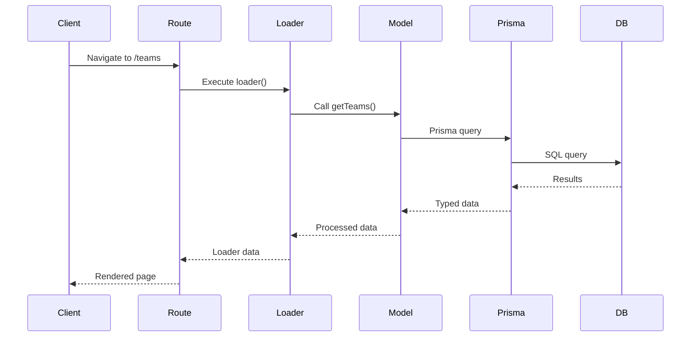

### Client-Side State Flow

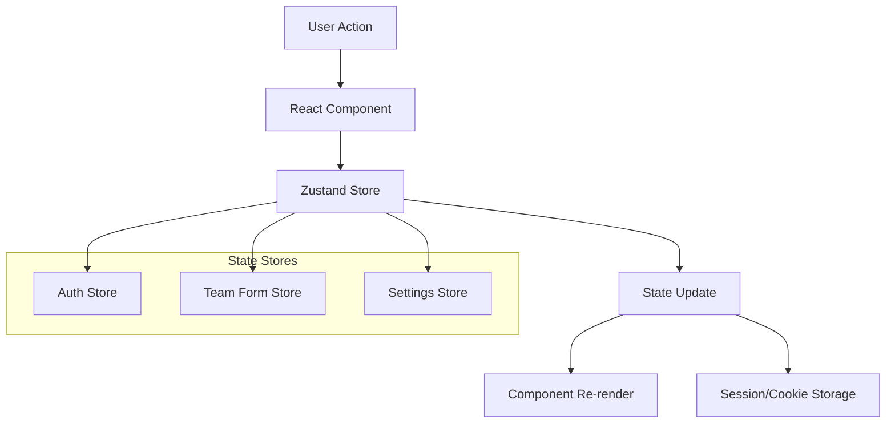

## Database Architecture

### Entity Relationship Diagram

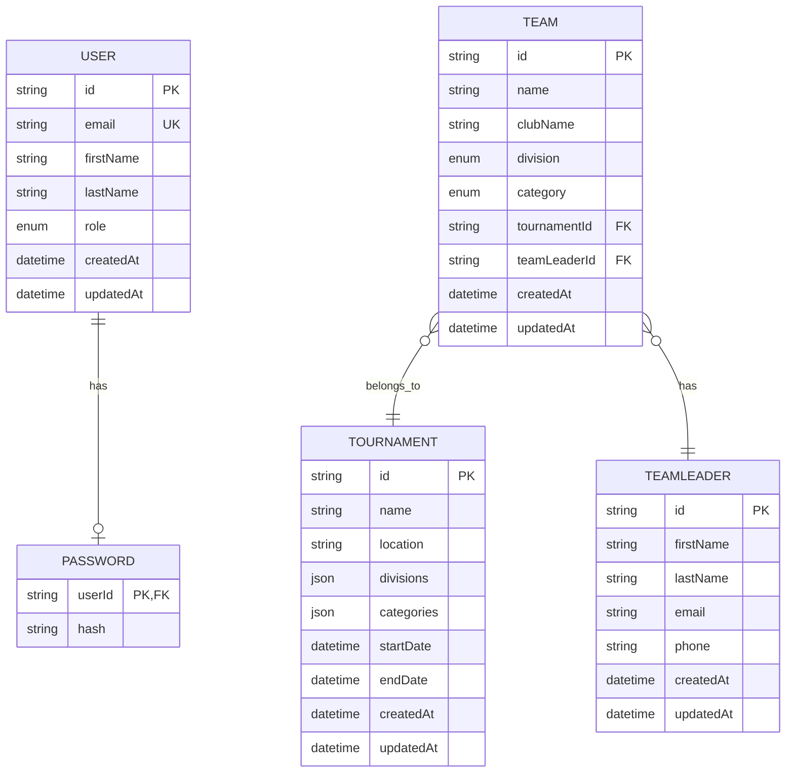

### Data Access Patterns

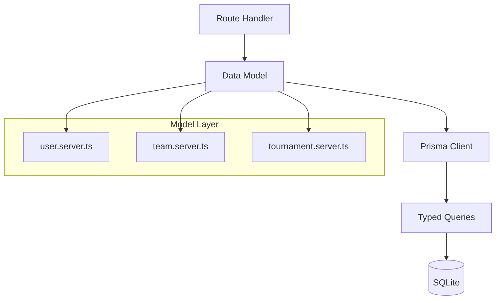

**Data Access Principles:**

- **Server-side only**: Database access restricted to `.server.ts` files
- **Type safety**: Prisma generates TypeScript types from schema
- **Query optimization**: Selective field loading with Prisma select
- **Relationship loading**: Explicit includes for related data

## Authentication & Authorization Flow

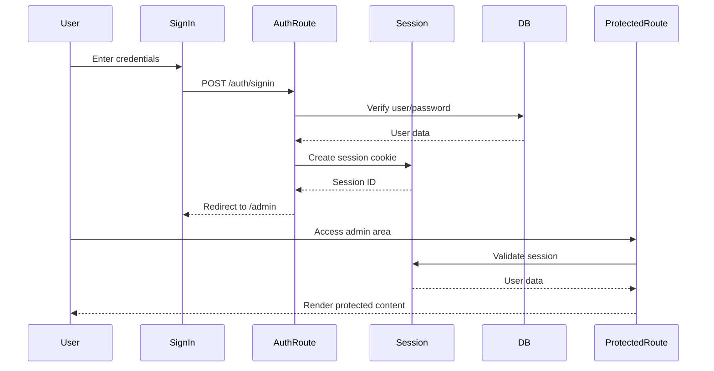

### Role-Based Access Control

```typescript
// Route metadata for access control
export const handle: RouteMetadata = {
   isPublic: false,
   auth: {
      required: true,
      redirectTo: '/auth/signin',
   },
   authorization: {
      requiredRoles: ['ADMIN'],
      roleMatchMode: 'any',
      redirectTo: '/unauthorized',
   },
}
```

## Testing Architecture

### Test Pyramid Structure

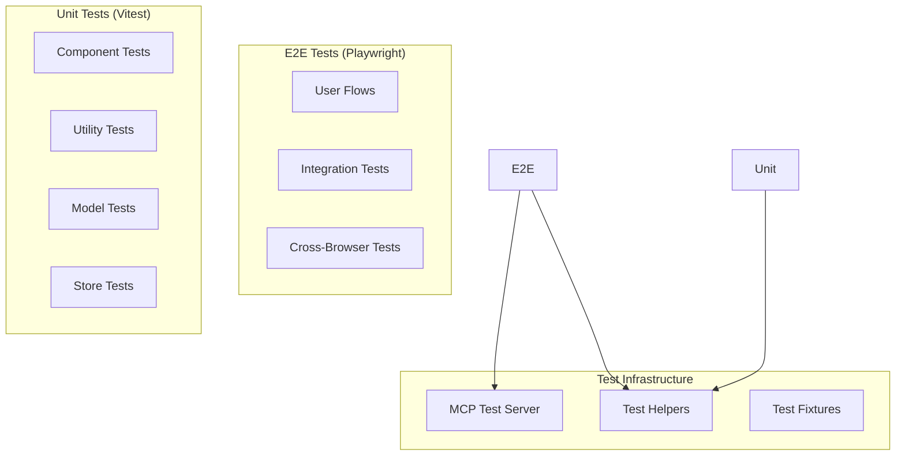

### Test Organization Patterns

- **Co-located tests**: `__tests__` folders adjacent to source code
- **Page Object Model**: Playwright tests use page objects for maintainability
- **Shared fixtures**: Common test setup and data creation utilities
- **Test isolation**: Each test runs with clean database state

## Performance Architecture

### Optimization Strategies

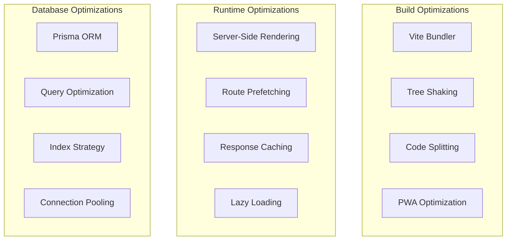

### Caching Strategy

- **Service Worker**: Offline-first caching for static assets
- **Session Storage**: Client-side form state persistence
- **Cookie Storage**: Authentication and preferences
- **Database Caching**: Prisma query result caching

## Deployment Architecture

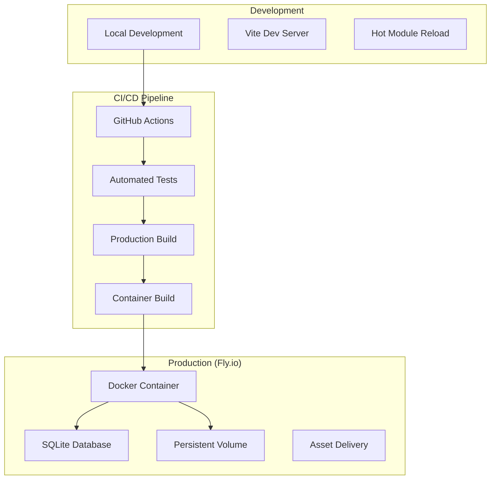

## Security Architecture

### Security Measures

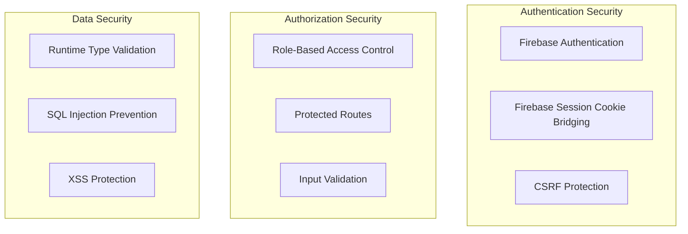

### Security Best Practices

- **Authentication**: Firebase Authentication with Google OAuth and Email/Password
- **Session Management**: Firebase session cookie bridging with HttpOnly, Secure, SameSite attributes
- **Input Validation**: Zod schema validation for all user inputs
- **SQL Injection Prevention**: Prisma ORM with parameterized queries
- **XSS Prevention**: React's built-in XSS protection + CSP headers

## CodeRabbit Architecture Analysis

### Form Submission Flow (Enhanced UX Pattern)

CodeRabbit identified a sophisticated form submission pattern that enhances user experience:

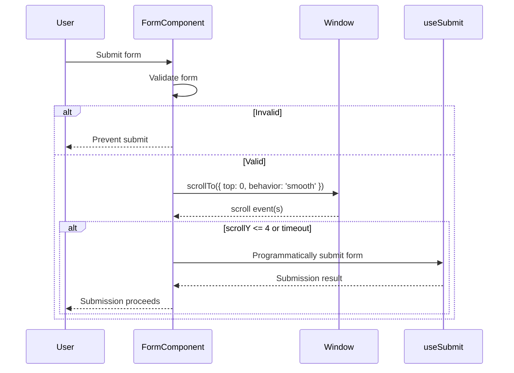

**Key Architecture Features:**

- **Smooth scroll-to-top**: Before form submission for better UX
- **Re-entry prevention**: Guards against duplicate submissions
- **Memory leak prevention**: Proper cleanup of scroll listeners
- **Timeout handling**: Fail-safe mechanisms for interrupted scroll

### Toast Notification System Architecture

CodeRabbit analyzed the toast notification system revealing advanced patterns:

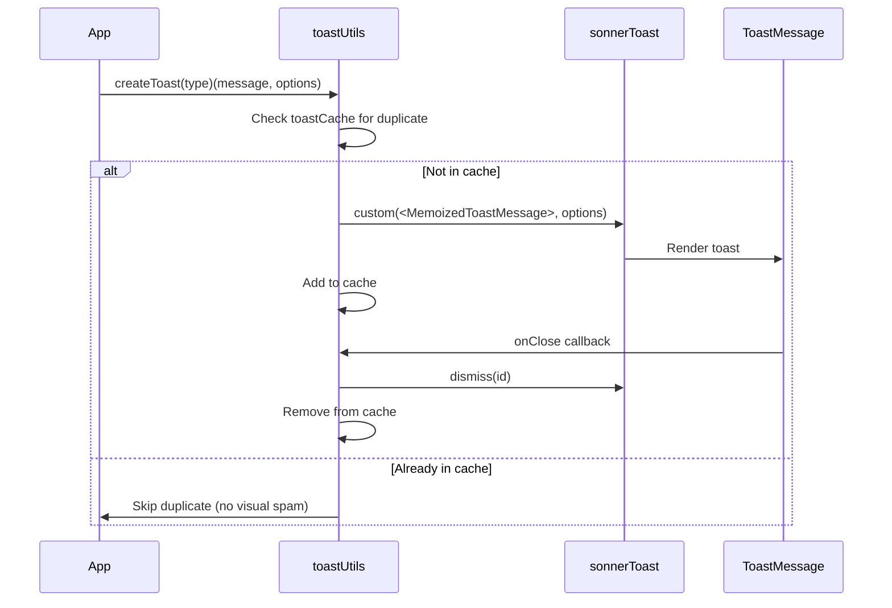

**Advanced Architecture Features:**

- **Duplicate Prevention**: Cache-based system prevents toast spam
- **Memory Optimization**: React.memo for performance
- **Auto-cleanup**: Automatic cache cleanup on toast dismissal
- **Type Safety**: Full TypeScript integration

## Code Quality Architecture

### Static Analysis Tools

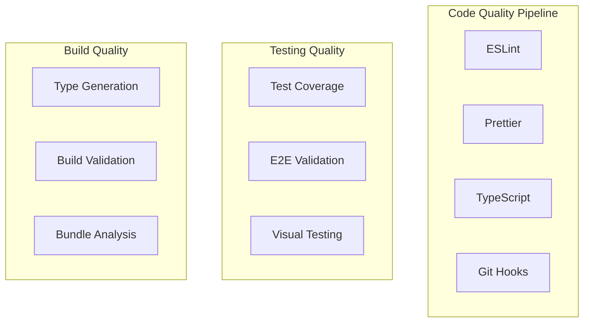

### Quality Metrics

- **Test Coverage**: 70% minimum across all metrics
- **Type Safety**: 100% TypeScript coverage, no `any` types
- **Code Style**: Automated formatting with Prettier
- **Linting**: Comprehensive ESLint rules with error prevention
- **Bundle Size**: Optimized with tree shaking and code splitting

## Scalability Considerations

### Current Architecture Strengths

1. **Component Modularity**: Well-organized, reusable components
2. **Type Safety**: Strong typing prevents runtime errors
3. **Database Optimization**: Efficient queries with Prisma
4. **Caching Strategy**: Multi-layer caching approach
5. **Testing Coverage**: Comprehensive test suite

### Future Scalability Paths

1. **Database Migration**: SQLite → PostgreSQL for production scale
2. **Microservices**: Extract domain services as needed
3. **CDN Integration**: Static asset optimization
4. **Horizontal Scaling**: Container orchestration preparation
5. **Performance Monitoring**: APM integration ready

#project #architecture #reference #ai-analysis
