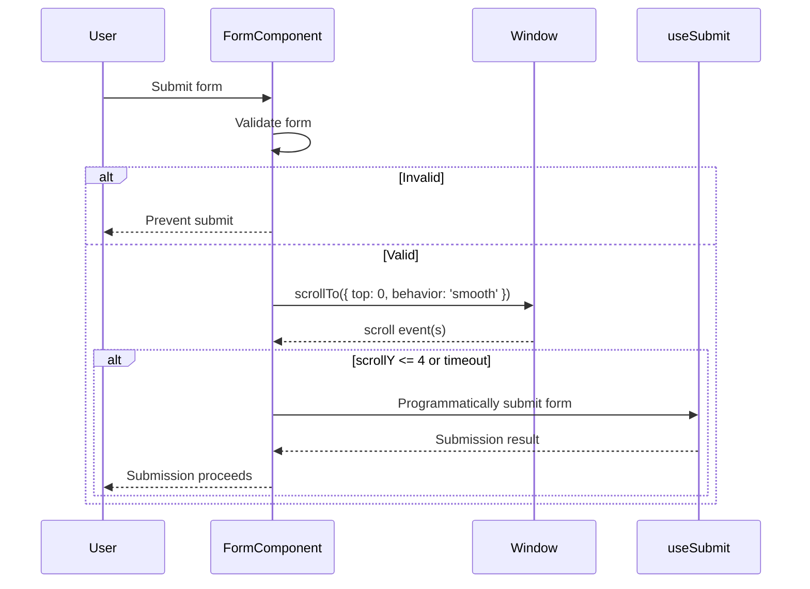
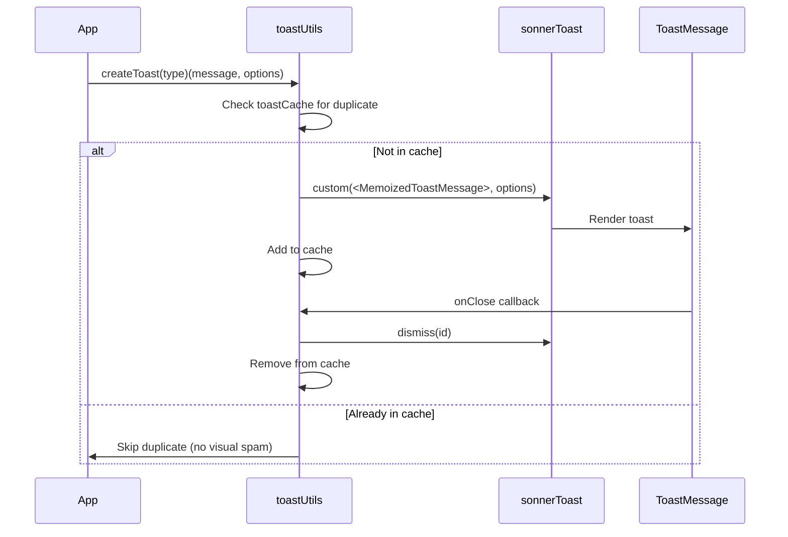

# UI Components

This document describes the key UI components in the Tournado application, with special focus on components that implement role-based access control.

## AppBar Component

The `AppBar` component provides the main navigation header for the application, including a context menu that adapts based on user authentication status and role permissions.

### Location

- **Component**: `app/components/AppBar.tsx`
- **Tests**: `app/components/__tests__/AppBar.test.tsx`

### Context Menu Functionality

The AppBar includes a responsive context menu (UserMenu) that displays different menu items based on the user's authentication status and role. The menu uses a unified implementation that adapts automatically to both mobile and desktop viewports.

#### Role-Based Access Control

The application supports three distinct user contexts:

##### 1. **Public Users (Not Authenticated)**

- **Status**: `authenticated = false`
- **User Object**: `null`
- **Visible Menu Items**:
   - Teams (public access)
   - About (public access)
   - Language Selector
   - Sign In

##### 2. **Authenticated Non-Admin Users**

- **Status**: `authenticated = true`
- **Roles**: `PUBLIC`, `MANAGER`, `REFEREE`, `ADMIN`
- **Visible Menu Items**:
   - Teams (public access)
   - Profile (authenticated only)
   - Settings (authenticated only)
   - About (public access)
   - Language Selector
   - Sign Out

##### 3. **Admin Users**

- **Status**: `authenticated = true`
- **Role**: `ADMIN`
- **Visible Menu Items**:
   - **Tournaments** (admin only) - First menu item
   - Teams (admin view)
   - **Admin Panel** (admin only)
   - Profile (authenticated only)
   - Settings (authenticated only)
   - About (public access)
   - Language Selector
   - Sign Out

#### Menu Structure

The context menu follows a consistent structure:

1. **Tournaments** - First for admin users only, with trophy icon
2. **Teams** - Available to all users (admin view for admins, public view for others)
3. **Divider** - Visual separator
4. **Admin Panel** - Only visible to users with `ADMIN` role
5. **Profile** - Available to authenticated users
6. **Settings** - Available to authenticated users
7. **About** - Available to all users
8. **Language Selector** - Available to all users
9. **Authentication Action** - Sign In (public) or Sign Out (authenticated)

#### Implementation Details

The role-based visibility is implemented through:

```typescript
// Check if user is admin
const isAdmin = user?.role === 'ADMIN'

// Admin Panel menu item - only added for admin users
...(isAdmin
  ? [
      {
        label: t('common.titles.adminPanel'),
        icon: 'admin_panel_settings',
        href: '/admin',
        authenticated: true,
      },
    ]
  : []),
```

Menu items are filtered based on authentication status:

```typescript
menuItems.filter(item => !item.authenticated || isAuthenticated)
```

This ensures that:

- Items marked `authenticated: true` only appear for authenticated users
- Items marked `authenticated: false` appear for all users
- Admin-specific items are conditionally added to the menu array

### Language Support

The context menu includes an integrated language switcher that:

- Displays "Language" as the menu item with a language icon
- Provides a submenu with all supported languages (Dutch, English, Arabic, Turkish)
- Uses flag emojis for visual identification of each language
- Highlights the currently active language with a light emerald background
- Maintains language state across the application through reactive persistence
- Uses the `useLanguageSwitcher` hook for language changes
- Supports proper RTL positioning for Arabic language mode

### Responsive Design

The AppBar renders a single unified UserMenu component that automatically adapts to different screen sizes:

- **Mobile Behavior**: Dropdown menu with touch-friendly interactions and collision detection
- **Desktop Behavior**: Dropdown menu with hover states and proper spacing from viewport edges

The unified implementation ensures consistent menu items and functionality across all devices while providing optimal positioning and spacing for each viewport size.

### Testing

The context menu functionality is thoroughly tested with 19 comprehensive unit tests covering:

- **Role-based visibility**: Verifies correct menu items for each user type
- **Authentication filtering**: Ensures protected items only show to authenticated users
- **Menu structure consistency**: Validates proper ordering and divider placement
- **Unified menu design**: Tests the single responsive menu implementation
- **Edge cases**: Handles null users, role changes, and navigation states

### Security Considerations

The context menu implements client-side UI filtering for user experience, but security is enforced at multiple levels:

1. **Server-side route protection**: Protected routes verify user permissions
2. **Component-level access control**: Components check user roles before rendering
3. **Database-level permissions**: User roles are validated against database records

The context menu serves as the first line of defense by hiding unauthorized options, but all security decisions are ultimately validated server-side.

## UserMenu Component

The `UserMenu` component is a reusable dropdown/overlay menu that powers the AppBar's context menu functionality.

### Location

- **Component**: `app/components/UserMenu.tsx`

### Features

- Unified responsive design that adapts to mobile and desktop viewports
- Support for dividers and submenus
- Icon integration with Material Symbols
- Customizable menu items with authentication requirements
- RTL (Right-to-Left) language support with proper positioning
- Keyboard navigation support
- Auto-close on navigation
- Collision detection to prevent off-screen positioning

### Props Type

```typescript
type MenuItemType = {
   label: string
   icon: string
   href?: string
   todo?: boolean
   action?: JSX.Element
   customIcon?: string
   authenticated?: boolean
   divider?: boolean
   subMenu?: Array<{
      label: string
      customIcon: string
      onClick: () => void
      active: boolean
   }>
}
```

This component provides the foundation for any dropdown menu needs throughout the application while maintaining consistent styling and behavior.

## 🎨 Design System Integration

All UI components in the Tournado application follow the comprehensive [Design System](design-system.md) which includes:

### Color Accent System

Components support **20+ color accents** through the CVA (Class Variance Authority) variants pattern:

```typescript
// Example: ActionLinkPanel color variants
color: {
  brand: 'border-brand-400',      // Red-based brand color
  primary: 'border-primary-400',  // Emerald-based primary color
  blue: 'border-blue-400',
  green: 'border-green-400',
  // ... 20+ total color accents
}
```

### Component Variants Structure

Each component with theming support follows this pattern:

```text
ComponentName/
├── ComponentName.tsx          # Main component implementation
├── ComponentName.variants.ts  # CVA color and style variants
├── index.ts                  # Export barrel
└── __tests__/
    └── ComponentName.test.tsx # Component tests
```

### Dark Mode Support

All components automatically support light and dark themes through semantic tokens:

- **Light Theme**: Uses semantic tokens like `--color-background` (white)
- **Dark Theme**: Automatically switches when `.dark` class is applied to root
- **Theme Toggle**: Available via `ThemeToggle` component in the AppBar

### Key Component Categories

#### 1. **Form Components**

- **TextInputField**: Semantic token-based inputs with validation states
- **ComboField**: Dropdown selections with accent color theming
- **CheckboxAgreementField**: Agreement checkboxes with brand accent
- **CustomDatePicker**: Date selection with primary color theming

#### 2. **Navigation Components**

- **ActionLinkPanel**: Full 20+ color accent system implementation
- **BottomNavigation**: Mobile navigation with semantic tokens
- **AppBar**: Theme-aware header with user menu

#### 3. **Interactive Components**

- **Button variants**: 6 variants × 10+ colors = 60+ combinations
- **ToggleChip**: Multi-state toggles with accent colors
- **TeamChip**: Team display chips with customizable accents

#### 4. **Layout Components**

- **Panel**: Container component with gradient backgrounds
- **SidebarLayout**: Admin layout with theme support
- **RouteTransition**: Animated transitions respecting theme and reduced motion preferences

### Implementation Guidelines

#### ✅ Best Practices

1. **Always use semantic tokens**: `bg-background`, `text-foreground`, `border-border`
2. **Support color accents**: Include color variants for visual variety
3. **Test both themes**: Verify component works in light and dark mode
4. **Follow CVA pattern**: Use Class Variance Authority for consistent APIs
5. **Include focus states**: Ensure accessibility with visible focus indicators

#### ❌ Anti-patterns

1. **Hard-coded colors**: Never use `bg-white`, `text-black`, `border-slate-200`
2. **Theme-specific styles**: Avoid conditional styling based on theme
3. **Missing variants**: Components should support multiple color accents when applicable
4. **Accessibility issues**: Always include proper contrast ratios and focus states

### Accessibility Features

All components include:

- **WCAG 2.1 AA compliance** - Color contrast ratios meet accessibility standards
- **Focus management** - Visible focus indicators on all interactive elements
- **Screen reader support** - Proper ARIA labels and semantic markup
- **Keyboard navigation** - Full keyboard accessibility for all interactions
- **RTL support** - Right-to-left language compatibility
- **Reduced motion compliance** - `RouteTransition` uses `useReducedMotion` to disable animations when users request it

### Performance Considerations

The design system is optimized for performance:

- **CSS Custom Properties** - Efficient theme switching without re-rendering
- **Tailwind CSS** - Optimized utility classes with automatic purging
- **Component variants** - CVA provides optimal class concatenation
- **Semantic tokens** - Consistent styling reduces CSS bundle size

For detailed implementation examples and advanced patterns, see the [Design System Documentation](design-system.md).

## 🎨 Icon System

The application features a comprehensive icon system with **29 optimized SVG components** that have been fully audited for theme compatibility:

### Icon System Status

- ✅ **29/29 icons audited** - Complete coverage
- ✅ **100% theme compatibility** - Perfect light/dark mode adaptation
- ✅ **Zero hard-coded colors** - All icons use `currentColor` inheritance
- ✅ **Complete accessibility** - Proper ARIA labeling throughout

### Key Icon Categories

- **Navigation & Interface** (8 icons) - AddIcon, ChevronIcons, AnimatedHamburgerIcon
- **User & Authentication** (6 icons) - PersonIcon, LoginIcon, AdminPanelSettings
- **Status & Feedback** (6 icons) - CheckMarkIcon, ErrorIcon, WarningIcon, TrophyIcon
- **Theme & Interface** (4 icons) - DarkModeIcon, LightModeIcon, LanguageIcon
- **Content & Actions** (6 icons) - HomeIcon, CalendarIcon, DeleteIcon

### Implementation Patterns

Icons follow consistent patterns for optimal theme integration:

```typescript
// Stroke-based icons (simple line art)
<svg stroke="currentColor" className="inline-block">
  <path d="..." />
</svg>

// Fill-based icons (Material Design)
<svg className="inline-block fill-current">
  <path d="..." />
</svg>
```

All icons support configurable sizing, weight variants, and accessibility features. For comprehensive usage guidelines and implementation details, see [Icon Guidelines](icon-guidelines.md).

## CodeRabbit UI/UX Analysis

### Form Submission Flow (Enhanced UX Pattern)

CodeRabbit identified a sophisticated form submission pattern that enhances user experience:



**Key UX Features:**

- **Smooth scroll-to-top**: Before form submission for better UX
- **Re-entry prevention**: Guards against duplicate submissions
- **Memory leak prevention**: Proper cleanup of scroll listeners
- **Timeout handling**: Fail-safe mechanisms for interrupted scroll

### Toast Notification System Architecture

CodeRabbit analyzed the toast notification system revealing advanced patterns:



**Advanced Features:**

- **Duplicate Prevention**: Cache-based system prevents toast spam
- **Memory Optimization**: React.memo for performance
- **Auto-cleanup**: Automatic cache cleanup on toast dismissal
- **Type Safety**: Full TypeScript integration

### UI Component Architecture Insights

**Component Quality Patterns:**

1. **Glass Morphism Effects**: Modern visual design with backdrop filters
2. **CVA Variants System**: Consistent theming across 20+ color accents
3. **Type Normalization**: Advanced TypeScript patterns for prop safety
4. **Accessibility First**: Complete WCAG 2.1 AA compliance
5. **Theme Adaptation**: Seamless light/dark mode switching

**Performance Optimizations:**

- **React.memo Usage**: Strategic memoization for toast components
- **CSS Custom Properties**: Efficient theme switching
- **SVG Icon Optimization**: currentColor inheritance patterns
- **Tailwind Purging**: Optimized CSS bundle sizes
