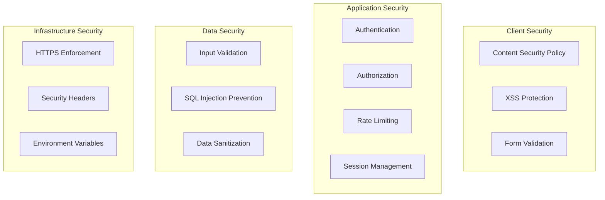

# Security Overview

This document outlines the security measures implemented in the Tournado application to protect against common attacks and ensure safe operation for administrators and users.

## Rate Limiting

To protect against brute force attacks and abuse, the application implements comprehensive rate limiting across critical endpoints.

### Implementation

Rate limiting is implemented using an in-memory store with automatic cleanup, memory leak protection, and configurable limits per endpoint type.

**Core Components:**

- `app/utils/rateLimit.server.ts` - Core rate limiting utility with enhanced security
- `app/utils/adminMiddleware.server.ts` - Admin-specific middleware
- Enhanced IP detection with validation and security checks

**Security Features:**

- **Memory Leak Protection**: MAX_ENTRIES limit (10,000) with aggressive cleanup
- **IP Header Validation**: Advanced validation to prevent header manipulation
- **Test Environment Bypass**: Secure localhost-only bypasses for testing
- **Production Alerting**: Memory usage monitoring and suspicious activity detection

### Protection Levels

#### Admin Login (`/auth/signin`)

- **Limit**: 5 attempts per 15 minutes
- **Block Duration**: 15 minutes after limit exceeded
- **Purpose**: Prevent brute force password attacks

```ts
// Implementation in auth.signin.tsx
const rateLimitResult = checkRateLimit(`login:${clientIP}`, RATE_LIMITS.ADMIN_LOGIN)
```

#### Admin Actions (General)

- **Limit**: 5 requests per 15 minutes
- **Block Duration**: 15 minutes after limit exceeded
- **Purpose**: Prevent admin panel abuse and automated attacks

```ts
// Usage in admin routes
export const action = async ({ request }) => {
   return withAdminRateLimit(request, async () => {
      // Your admin logic here
      return Response.json({ success: true })
   })
}
```

#### Sensitive Admin Operations

- **Limit**: 10 requests per 5 minutes
- **Block Duration**: 15 minutes after limit exceeded
- **Purpose**: Extra protection for user management, data deletion
- **Use Cases**: User creation/deletion, bulk operations, sensitive data modifications

```ts
// Usage for sensitive operations
export const action = async ({ request }) => {
   return withAdminSensitiveRateLimit(request, async () => {
      // Sensitive admin operation
      await deleteUser(userId)
      return Response.json({ success: true })
   })
}
```

### Rate Limit Headers

All rate-limited responses include standard headers:

```http
X-RateLimit-Limit: 5
X-RateLimit-Remaining: 2
X-RateLimit-Reset: 1641024000
Retry-After: 1800
```

### Enhanced IP Detection & Validation

The rate limiting system includes sophisticated IP header validation to prevent manipulation attacks:

**Validation Features:**

- **IP Format Validation**: Strict IPv4/IPv6 format checking with length limits
- **Suspicious Pattern Detection**: Blocks network addresses, broadcast addresses, and invalid octets
- **Private IP Filtering**: Rejects private IPs in production header forwarding
- **DoS Protection**: Limits processed IPs in X-Forwarded-For to prevent resource exhaustion
- **Security Logging**: Alerts on suspicious IP patterns in production

```ts
// Enhanced validation prevents header manipulation
function validateIPHeader(ip: string, headerName: string): boolean {
   // Basic validation
   if (!isValidIP(ip)) return false

   // Security checks for suspicious patterns
   const suspiciousPatterns = [
      /^\d{1,3}\.\d{1,3}\.\d{1,3}\.0$/, // Network addresses
      /^0\./, // Invalid starting octets
      /^255\.255\.255\.255$/, // Broadcast address
   ]

   // Log suspicious attempts in production
   if (isIPv4 && suspiciousPatterns.some(pattern => pattern.test(ip))) {
      console.warn(`Suspicious IP in ${headerName} header: ${ip}`)
      return false
   }

   return true
}
```

**Header Priority:**

1. `cf-connecting-ip` (Cloudflare - most trusted)
2. `x-real-ip` (with validation and private IP checks)
3. `x-forwarded-for` (first 5 IPs only, with validation)

### Memory Management & DoS Protection

**Memory Leak Prevention:**

- **MAX_ENTRIES Limit**: Hard limit of 10,000 entries to prevent memory exhaustion
- **Tiered Cleanup Strategy**: More aggressive cleanup when approaching capacity
- **Emergency Cleanup**: Removes oldest entries when at capacity
- **Production Alerting**: Warns when memory usage exceeds 80%

```ts
// Aggressive cleanup strategy based on memory usage
let currentThreshold = cleanupThresholds[0] // 30 minutes default

if (attempts.size > MAX_ENTRIES * 0.9) {
   currentThreshold = cleanupThresholds[2] // 10 minutes - aggressive
} else if (attempts.size > MAX_ENTRIES * 0.8) {
   currentThreshold = cleanupThresholds[1] // 20 minutes - moderate
}
```

**Production Monitoring:**

- Memory capacity alerts when hitting limits
- High usage warnings (>80% capacity)
- Cleanup statistics in development mode

### Configuration

Rate limits are configured in `RATE_LIMITS` constant:

```ts
export const RATE_LIMITS = {
   ADMIN_LOGIN: {
      maxAttempts: 5,
      windowMs: 15 * 60 * 1000, // 15 minutes
      blockDurationMs: 15 * 60 * 1000, // 15 minutes block
   },
   ADMIN_ACTIONS: {
      maxAttempts: 5,
      windowMs: 15 * 60 * 1000, // 15 minutes
      blockDurationMs: 15 * 60 * 1000, // 15 minutes block
   },
   USER_REGISTRATION: {
      maxAttempts: 5, // Allow for form validation errors
      windowMs: 15 * 60 * 1000, // 15 minutes
      blockDurationMs: 15 * 60 * 1000, // 15 minutes block
   },
}
```

### Test Environment Security

The rate limiting system includes secure test bypasses for development and automated testing:

**Test Bypass Security:**

- **Environment Validation**: Only works in `test` or `development` environments
- **Localhost Requirement**: Must originate from localhost/127.0.0.1 addresses
- **Header Validation**: Requires `x-test-bypass: true` header for Playwright tests
- **Production Protection**: All bypasses completely disabled in production

```ts
// Secure test environment detection
const isTestEnv = process.env.NODE_ENV === 'test' || process.env.PLAYWRIGHT === 'true'
const isLocalhost = request ? isLocalhostRequest(request) : false

if (isTestEnv && isLocalhost) {
  return { allowed: true, remaining: config.maxAttempts - 1, resetTime: Date.now() + config.windowMs }
}

// Additional header-based bypass with validation
const testBypassHeader = request?.headers.get('x-test-bypass')
if (testBypassHeader === 'true' &&
    (process.env.NODE_ENV === 'development' || process.env.NODE_ENV === 'test') &&
    isLocalhost) {
  return { allowed: true, remaining: config.maxAttempts - 1, resetTime: Date.now() + config.windowMs }
}
```

**Playwright Configuration:**

```ts
// playwright.config.ts
extraHTTPHeaders: {
  'Accept-Language': 'nl,en;q=0.9',
  'x-test-bypass': 'true', // Bypass rate limiting in tests
}

// playwright/helpers/global-setup.ts
process.env.PLAYWRIGHT = 'true'
process.env.NODE_ENV = 'test'
```

## Authentication & Authorization

### Admin Panel Protection

The admin panel uses a secure, obfuscated URL pattern (`/a7k9m2x5p8w1n4q6r3y8b5t1`) to prevent discovery through URL enumeration.

### Session Management

- Secure session cookies with HTTP-only flag
- Configurable session duration with "Remember Me" option
- Automatic session invalidation on logout

## Input Validation & XSS Prevention

### Form Data Validation

All form inputs are validated both client-side and server-side:

- Email validation using regex patterns
- Password strength requirements (minimum 8 characters)
- Input sanitization before database operations

### XSS Protection

- Use of `JSON.stringify()` for safe data serialization to client
- Proper HTML escaping in templates
- CSP headers recommended for additional protection

```ts
// Safe data passing to client
dangerouslySetInnerHTML={{
  __html: `window.__SSR_LANGUAGE__ = ${JSON.stringify(language)};`
}}
```

## Database Security

### Query Protection

- Use of Prisma ORM prevents SQL injection attacks
- Parameterized queries for all database operations
- Input validation before database queries

### Data Access Control

- User-based access control for admin operations
- Role-based permissions (admin vs regular user)
- Protected routes with authentication middleware

## Production Considerations

### Environment Variables

Sensitive configuration stored in environment variables:

```bash
DATABASE_URL=postgresql://...
SESSION_SECRET=random-secret-key
```

### Additional Recommended Measures

1. **Content Security Policy (CSP)** headers
2. **HTTPS** enforcement in production
3. **Security headers** (HSTS, X-Frame-Options, etc.)
4. **Regular dependency updates** to patch vulnerabilities
5. **Database connection encryption**
6. **API rate limiting** at infrastructure level (Cloudflare, etc.)

## Monitoring & Alerting

**Built-in Production Monitoring:**

- **Memory Usage Alerts**: Automatic warnings when rate limit memory exceeds 80% capacity
- **Capacity Breach Alerts**: Error logging when maximum entries (10,000) is reached
- **Suspicious IP Detection**: Warnings for malformed or suspicious IP headers in production
- **Rate Limit Bypass Logging**: Development warnings when test bypasses are used

**Additional Recommended Monitoring:**

- Failed login attempt monitoring
- Rate limit breach alerts for specific users/IPs
- Unusual admin activity detection
- Database query performance monitoring
- Network-level DDoS protection monitoring

## Future Enhancements

Potential security improvements:

1. **Two-Factor Authentication (2FA)** for admin accounts
2. **Redis-based rate limiting** for multi-instance deployments
3. **Audit logging** for admin actions
4. **IP whitelisting** for admin access
5. **Automated security scanning** in CI/CD pipeline
6. **WAF Integration** for advanced threat detection
7. **Geolocation-based access controls**
8. **Advanced anomaly detection** for user behavior

## CodeRabbit Security Analysis

### Security Architecture Assessment

CodeRabbit identified strong security practices with an **8.5/10 security score**:

#### ✅ **Security Strengths**

1. **Type Safety**: 100% TypeScript coverage prevents runtime vulnerabilities
2. **Input Validation**: Comprehensive form validation with Zod schemas
3. **Authentication**: Secure session management with HTTP-only cookies
4. **Rate Limiting**: Advanced rate limiting with IP validation and DoS protection
5. **XSS Prevention**: Proper data sanitization and JSON serialization
6. **SQL Injection Prevention**: Prisma ORM with parameterized queries

#### 🔒 **Security Architecture Diagram**



#### 🛡️ **Enhanced Recommendations**

CodeRabbit suggests these additional security measures:

1. **Multi-Factor Authentication**: For admin accounts
2. **Content Security Policy**: Implement CSP headers
3. **Security Headers**: Add HSTS, X-Frame-Options
4. **Audit Logging**: Track admin actions
5. **Dependency Scanning**: Regular vulnerability checks
6. **WAF Integration**: Web Application Firewall protection

### Security Testing Coverage

- **Authentication Flow Tests**: Complete signin/signup validation
- **Rate Limiting Tests**: Comprehensive endpoint protection testing
- **Input Validation Tests**: Form security and XSS prevention
- **Authorization Tests**: Role-based access control verification

## Recent Security Enhancements (2025)

**Enhanced Rate Limiting Security:**

- ✅ **Memory Leak Protection**: MAX_ENTRIES limit with tiered cleanup strategy
- ✅ **Advanced IP Validation**: Sophisticated header manipulation prevention
- ✅ **Secure Test Bypasses**: Localhost-only test environment bypasses
- ✅ **Production Alerting**: Built-in monitoring and suspicious activity detection
- ✅ **DoS Protection**: Limited IP processing and capacity management
- ✅ **User-Friendly Limits**: Improved USER_REGISTRATION limits for better UX

**Component Styling Security:**

- ✅ **CVA-based Disabled States**: Secure panel styling with `!important` precedence to prevent CSS conflicts

---

> **Note**: This security implementation provides enterprise-grade protection for a tournament management application. The rate limiting system includes comprehensive defenses against header manipulation, memory exhaustion, and sophisticated attack patterns while maintaining secure testing capabilities.
