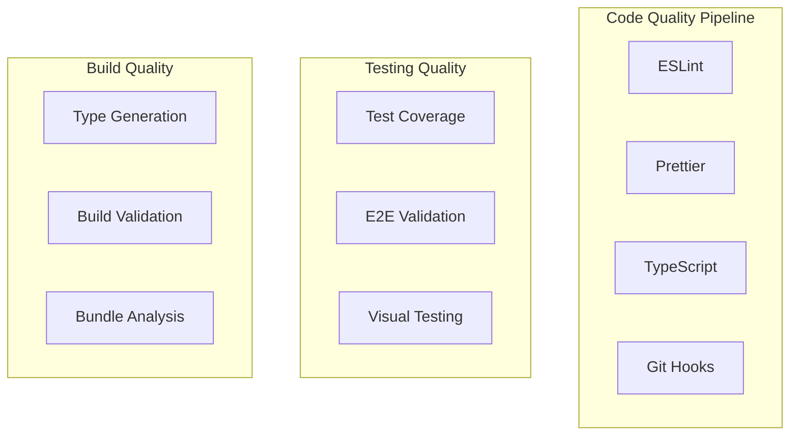

# Testing

## Overview

The project uses a comprehensive testing strategy with multiple testing tools:

- **Playwright**: End-to-end testing
- **Vitest**: Unit testing with AI-powered MCP integration
- **Testing Library**: Component testing utilities
- **MCP Vitest Server**: Advanced AI-assisted testing workflows

### 🚀 AI-Powered Testing with MCP

The project includes a sophisticated **Model Context Protocol (MCP) server** that enables AI-assisted testing workflows:

- **3 Core Tools**: Execute tests, analyze coverage, and health checks
- **3 Intelligent Resources**: Persistent test data, coverage reports, and summaries
- **584 tests** across 24 test suites with comprehensive coverage analysis
- **Smart project detection** - works from any directory
- **Real-time integration** with AI development tools like Cursor

[📖 **Detailed MCP Documentation**](vitest-mcp.md) - Complete guide to AI-assisted testing capabilities

## Running Tests

### All Tests

```sh
pnpm test
```

### End-to-End Tests

```sh
# Run E2E tests in development mode
pnpm test:e2e:dev

# Run E2E tests in headless mode (starts server)
pnpm test:e2e:all
```

[📖 **Comprehensive Playwright Guide**](playwright-guide.md) - Complete guide to our Playwright setup with authentication contexts and Page Object Model

### Unit Tests

```sh
# Run unit tests
pnpm test:unit

# Run unit tests in watch mode
pnpm test:unit:watch
```

## Database Isolation

### Separate Test Database

E2E tests use a completely separate SQLite database to ensure isolation from development data:

- **Development database**: `prisma/data.db`
- **Test database**: `prisma/data-test.db` (automatically managed)

### Automatic Test Database Setup

When running E2E tests via `pnpm test:e2e:all` or `pnpm test:e2e:dev`, the system automatically:

1. Removes any existing test database
2. Creates a fresh test database using `prisma migrate deploy`
3. Seeds the test database with initial data
4. Sets `DATABASE_URL` environment variable to point to the test database

This ensures every test run starts with a clean, predictable database state without affecting your development data.

## Environment Requirements

### ✅ SESSION_SECRET Environment Variable (2024)

**Critical**: Tests now require `SESSION_SECRET` environment variable due to authentication module loading:

```typescript
// test/setup-test-env.ts
process.env.SESSION_SECRET = 'test-session-secret-for-vitest-tests'
```

**Why this changed**: When importing `@prisma/client` types in tests, the session server module gets loaded at runtime, which requires `SESSION_SECRET` at module initialization time. This change occurred when we updated components to use Prisma enum types directly.

**Impact**: Without this environment variable, tests will fail with:

```
Error: SESSION_SECRET must be set
```

**Solution**: The environment variable is automatically set in `test/setup-test-env.ts`, so no additional configuration is needed for developers.

## Test Structure

### File Organization

```
test/
  ├── routes/                   # Route component unit tests
  │   ├── index.test.tsx        # Home page tests
  │   ├── about.test.tsx        # About page tests
  │   └── teams-index.test.tsx  # Teams index tests
  ├── setup-test-env.ts         # Vitest test environment setup
  └── prisma-test.ts           # Database connectivity tests

app/components/
  └── __tests__/               # Component unit tests
      ├── AppBar.test.tsx      # Navigation component tests
      ├── TeamForm.test.tsx    # Form component tests
      └── ...

app/utils/
  └── __tests__/               # Utility function tests
      ├── misc.test.tsx        # Miscellaneous utilities
      ├── utils.test.ts        # Core utilities
      └── ...

playwright/
  ├── tests/                   # End-to-end tests
  │   ├── auth.spec.ts         # Authentication flow tests (no-auth project)
  │   ├── admin-*.spec.ts      # Admin feature tests (admin-authenticated project)
  │   ├── user-authorization.spec.ts # User permission tests (user-authenticated project)
  │   └── *.spec.ts            # Public access tests (no-auth project)
  ├── pages/                   # Page object models
  │   ├── BasePage.ts          # Common page functionality
  │   ├── HomePage.ts          # Homepage interactions
  │   ├── LoginPage.ts         # Authentication flows
  │   └── SignupPage.ts        # Registration flows
  ├── helpers/                 # Playwright helper functions
  │   ├── database.ts          # Test user creation/cleanup
  │   ├── global-setup.ts      # Authentication context setup
  │   └── test-utils.ts        # Common test utilities
  └── .auth/                   # Authentication contexts (generated)
      ├── admin-auth.json      # Admin user session
      └── user-auth.json       # Regular user session
```

### Test File Guidelines

- **Route Tests**: `test/routes/` - Tests for route components to avoid interference with file-based routing
- **Component Tests**: `app/components/__tests__/` - Tests for reusable React components
- **Utility Tests**: `app/utils/__tests__/` - Tests for helper functions and utilities
- **E2E Tests**: `playwright/tests/` - Full user journey tests

## Writing Tests

### E2E Tests

Use Playwright for testing user flows and critical paths:

```ts
import { expect, test } from '@playwright/test'

test.describe('Authentication', () => {
   test('should allow users to sign in', async ({ page }) => {
      await page.goto('/auth/signin')
      await page.locator('#email').fill('test@example.com')
      await page.locator('#password').fill('password')
      await page.getByRole('button', { name: 'Inloggen' }).click()
      await expect(page).toHaveURL('/')
   })
})
```

**Key Features:**

- **Authentication Contexts**: Pre-authenticated admin and user contexts for fast test execution
- **Page Object Model**: Structured, reusable page interactions
- **Smart Test Organization**: Three projects (admin-authenticated, user-authenticated, no-auth)
- **Dutch Language Support**: Tests work with Dutch UI text
- **Mobile-First Testing**: Consistent mobile viewport testing

### Unit Tests

Use Vitest for testing individual components and utilities:

```ts
import { render, screen } from '@testing-library/react'
import { expect, test } from 'vitest'
import { Button } from './Button'

test('renders button with correct text', () => {
  render(<Button>Click me</Button>)
  expect(screen.getByText('Click me')).toBeInTheDocument()
})
```

## Test Utilities

### Authentication Helpers

```ts
import { createAdminUser, createRegularUser } from '../helpers/database'
import { LoginPage } from '../pages/LoginPage'

// Create and use test users for auth flow tests
test('admin feature', async ({ page }) => {
   const user = await createAdminUser()
   const loginPage = new LoginPage(page)
   await loginPage.login(user.email, 'MyReallyStr0ngPassw0rd!!!')
   // Test logic here...
})

// Tests can also use pre-authenticated state via projects:
// - admin-authenticated: Uses admin-auth.json (for admin features)
// - user-authenticated: Uses user-auth.json (for user permissions)
// - no-auth: No authentication (for auth flows & public access)
```

## CodeRabbit Testing Analysis

### Test Coverage Assessment

CodeRabbit identified comprehensive testing coverage across the application:

- **Overall Quality Score**: 8.5/10
- **Unit Test Coverage**: Component-level testing with React Testing Library
- **E2E Test Coverage**: Playwright tests covering critical user flows
- **Type Safety**: 100% TypeScript coverage prevents runtime errors
- **Test Organization**: Well-structured test hierarchy with proper isolation

### Testing Architecture Strengths

1. **Comprehensive Test Suite**: Multiple testing layers (unit, integration, E2E)
2. **Authentication Testing**: Pre-authenticated contexts for efficient testing
3. **Database Isolation**: Separate test databases prevent data conflicts
4. **Page Object Model**: Reusable, maintainable test components
5. **Mobile-First Testing**: Consistent mobile viewport coverage

### Testing Quality Pipeline



### Quality Metrics

- **Test Coverage**: 70% minimum across all metrics
- **Type Safety**: 100% TypeScript coverage, no `any` types
- **Code Style**: Automated formatting with Prettier
- **Linting**: Comprehensive ESLint rules with error prevention
- **Bundle Size**: Optimized with tree shaking and code splitting

## Best Practices

1. Write tests for critical user flows
2. Keep tests isolated and independent
3. Use meaningful test descriptions
4. Follow the testing pyramid principle
5. Mock external dependencies
6. Clean up after tests
